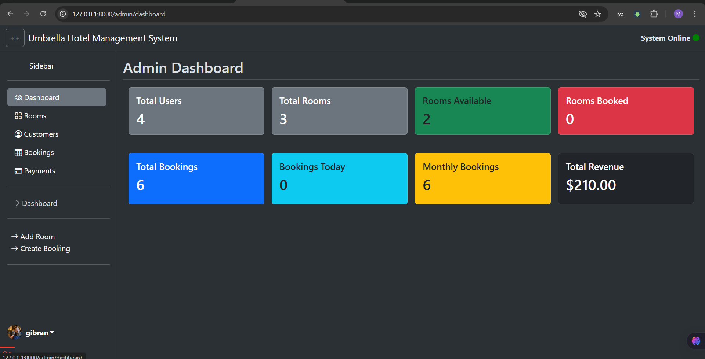
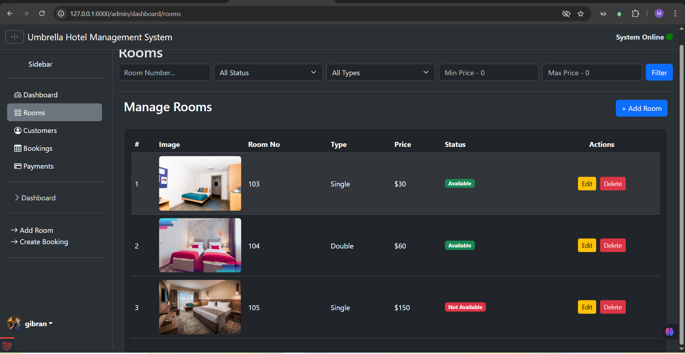
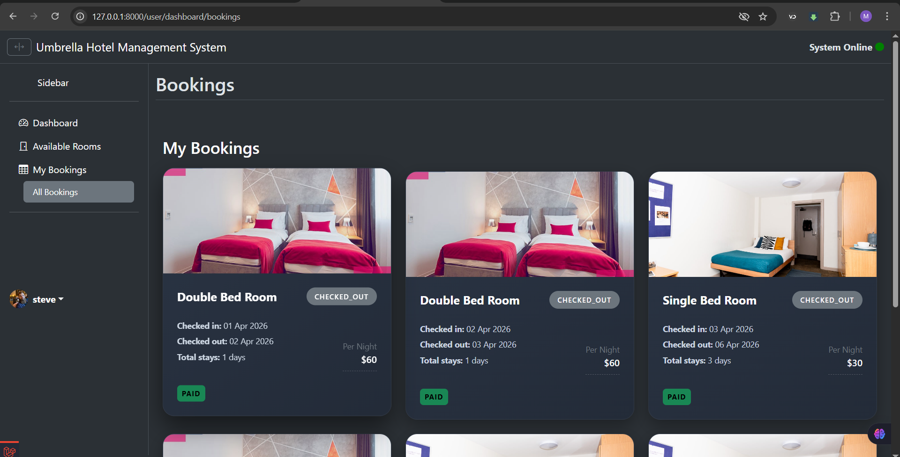
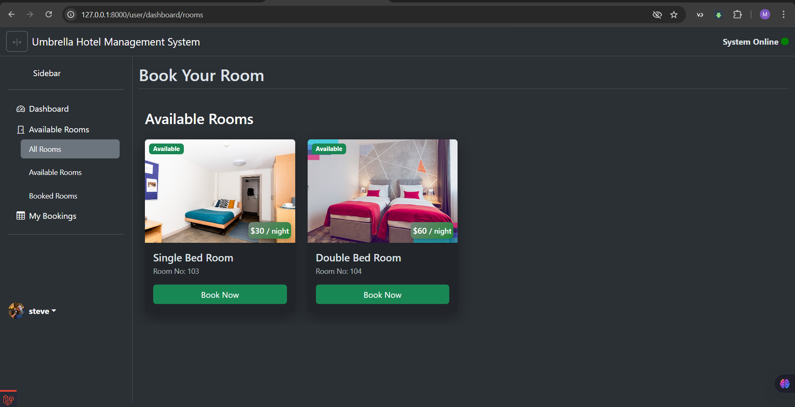
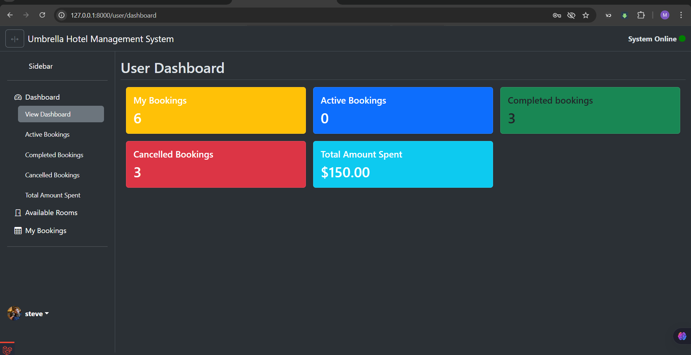

# 🏨 Hotel Management System

**Laravel Backend System** for managing rooms, bookings, customers, and payments.

---

## 🚀 Features
- **Room Management:** Add, update, and delete rooms.
- **Booking Management:** Track and manage customer bookings.
- **Customer Management:** Maintain detailed customer records.
- **Admin Dashboard:** Monitor all activities with a clean interface.
- **User Dashboard:** Manage all the user side functionality. Room bookings and payments.
- **Billing & Invoicing:** Generate bills for completed stays.
- **Secure Authentication:** Role-based login for admin and staff.

---

## 🛠️ Technologies Used
- **Backend:** Laravel, PHP
- **Database:** MySQL
- **Frontend:** Bootstrap, HTML, CSS
- **Tools:** Composer, Artisan CLI, PhpMyadmin, TablePlus

---
## 🖼️ Screenshots






## 📦 Installation
1. Clone the repository:  
   ```bash
   git clone https://github.com/RoboticBrain/hotel-management-system
